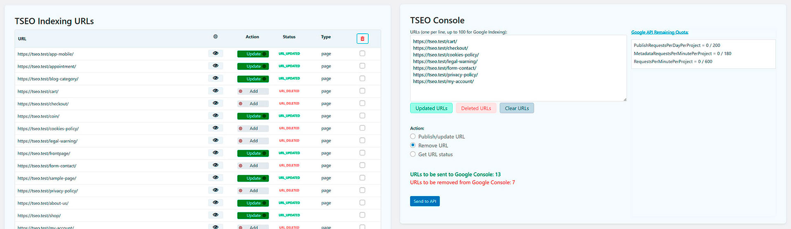
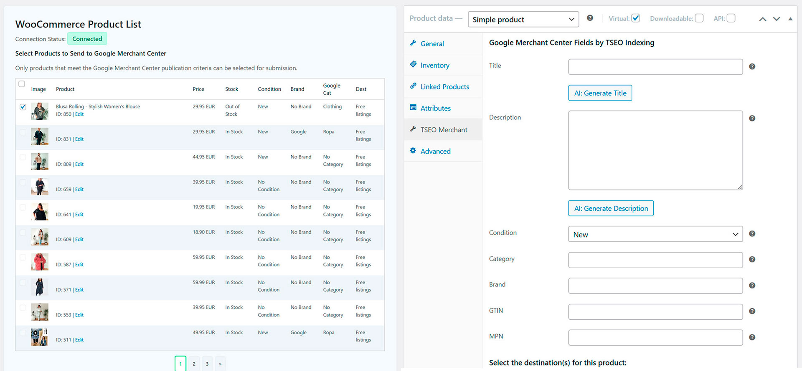

# TSEO Indexing

## Gestión para la indexación de URLs en Google Search Console y administración de listados de productos para Google Merchant Center con IA integrada.

* Contributors: devtseo
* Tags: wordpress, google, seo, indexing, openai, seo-optimization, google-api, positioning, plugins-wordpress, google-indexing-api, google-console, google-merchant-center
* Requires at least: 6.0
* Tested up to: 6.5.4
* Stable tag: 1.0.0
* Requires PHP: 8.1
* Text Domain: tseoindexing
* Domain Path: /languages/
* License: GPLv2
* License URI: http://www.gnu.org/licenses/gpl-2.0.txt

## Documentación

- [Inglés (por defecto)](README.md)
- [Español (README-ES.md)](README-ES.md)

## Descripción

Este complemento notifica a la API de Indexación de Google sobre publicaciones nuevas o actualizadas y puede solicitar la eliminación de páginas. Se integra con Google Merchant Center para configurar y enviar fácilmente listados de productos, utilizando IA para generar títulos y descripciones optimizados. Es necesario tener WooCommerce para acceder a las funciones de Merchant Center.

El plugin facilita la rápida indexación de tus páginas en Google Search Console y Google Merchant Center, pero no garantiza que las URLs enviadas se posicionen en los motores de búsqueda a menos que se apoyen en contenido de calidad, con un SEO On-page eficaz y técnicas profesionales de SEO Off-page.

Si buscas un posicionamiento web eficiente que genere visitas, te recomendamos encarecidamente nuestro servicio estrella **TSEO PRO:** [https://tseo.pro](https://tseo.pro). Este servicio ofrece una plantilla web en "Renting" para WordPress, con soporte académico para la realización de SEO Off-page profesional. TSEO PRO viene ya súper optimizado para el SEO On-page, por lo que no tendrás que preocuparte por este aspecto, que es el más difícil de lograr, ya que nuestros técnicos están en constante vigilancia de los cambios en los algoritmos de los motores de búsqueda.

¿Por qué "Renting"? Porque de esta manera te acompañamos en cada paso del camino para asegurar el éxito de tu negocio en internet con soporte técnico permanente. Además, incluye actualizaciones constantes que adaptan el código fuente a las exigencias de los algoritmos de los buscadores.

El bajo costo del "Renting Web" (€29.95/mes) en comparación con los servicios externos necesarios para poder posicionar tu web, que en la mayoría de los casos cuesta alrededor de €700 al mes, hace de este un servicio único en su género.

>[!IMPORTANTE]
>
> 1. **Indexar ≠ Posicionar**: La indexación no equivale al posicionamiento. Este complemento no ayudará a que tu página se posicione en Google; solo notificará a Google sobre la existencia de tus páginas.
> 2. Este plugin utiliza la [API de Indexación de Google](https://developers.google.com/search/apis/indexing-api/v3/quickstart). No recomendamos usar este complemento para contenido spam o de baja calidad.
> 3. Para Google Merchant Center, también necesitarás la [API de Merchant](https://support.google.com/merchants/answer/7514752) y un [Merchant ID](https://support.google.com/paymentscenter/answer/7163092) para gestionar listados gratuitos y/o con publicidad. Además, necesitarás una [ApiKey de OpenAI](https://openai.com/api/) para generar títulos y descripciones optimizados para cada ficha.

### Características Principales:

- **Gestión de URLs**: Lista todas las URLs en el sitio para gestionar cuáles indexar, actualizar o eliminar.
- **Procesamiento Automático y Manual**: Proporciona una consola para procesar automáticamente las URLs listadas o manejarlas manualmente.
- **Herramienta de Limpieza de URLs**: Incluye una herramienta para limpiar URLs obtenidas mediante copiar y pegar desde Google Search Console.
- **Integración con WooCommerce**: Si usas WooCommerce, lista todos los productos para configurar cuáles enviar a Google Merchant Center.
- **Configuración de Merchant Center**: Agrega una nueva pestaña en la pantalla de edición de productos para configurar los atributos esenciales requeridos por Merchant Center.

**TSEO Indexing** simplifica el proceso de indexación de URLs en Google Search Console y la gestión de productos en Google Merchant Center. ¡Posiciona tu sitio web de manera efectiva y, si tienes una tienda WooCommerce, publica tus productos de forma gratuita!

## Instalación

1. Sube la carpeta `tseoindexing` al directorio `/wp-content/plugins/`.
2. Activa el plugin a través del menú 'Plugins' en WordPress.
3. Navega al nuevo menú "TSEO Indexing" en tu panel de control para agregar y gestionar tus sitios web.

### Configuración Inicial:
   - Después de la activación, ve al menú "TSEO Indexing" en el panel de control de WordPress para configurar tus integraciones con Google Search Console y Google Merchant Center.

## Preguntas Frecuentes

### ¿Funciona este plugin en multisite?

Sí, el plugin ha sido probado y verificado en WordPress Multisite.

### ¿Es necesario WooCommerce para todas las funciones?

No, WooCommerce solo es necesario para las funciones de integración con Google Merchant Center.

### ¿Cómo genera la IA títulos y descripciones optimizados?

La IA utiliza algoritmos avanzados para analizar tu contenido y crear títulos y descripciones amigables con el SEO.

### ¿El plugin admite varios idiomas?

Actualmente, el plugin está diseñado para soportar inglés y español. Sin embargo, se pueden agregar traducciones para otros idiomas según sea necesario.

### ¿Puedo programar el proceso de indexación?

No, en este momento el plugin no soporta la programación. Debes activar manualmente el proceso de indexación.

### ¿Qué debo hacer si mi URL no es indexada por Google?

Asegúrate de que tu contenido cumpla con las directrices de calidad de Google y no viole ninguna de sus políticas. El plugin solo informa a Google sobre tus URLs, pero Google decide si indexarlas o no.

### ¿Puedo usar este plugin en sitios web con alto tráfico?

Sí, el plugin está diseñado para manejar sitios web de todos los tamaños. Sin embargo, para sitios con muy alto tráfico, se recomienda monitorear el rendimiento y asegurarse de que los recursos del servidor sean adecuados.

### ¿Cómo puedo solucionar problemas con el plugin?

Revisa la configuración del plugin y asegúrate de que todas las claves API e IDs estén configuradas correctamente. Consulta la documentación del plugin para obtener pasos detallados de solución de problemas. Si los problemas persisten, contacta con el soporte.

### ¿Existen límites de uso para la API de Indexación de Google?

Sí, Google impone límites en el número de solicitudes de indexación por día. Asegúrate de consultar la [cuota de la API de Indexación de Google](https://developers.google.com/search/apis/indexing-api/v3/quota-pricing) para conocer los últimos límites y directrices.

### ¿Qué sucede si excedo los límites de solicitud de la API?

Si excedes los límites de solicitud de la API, tus solicitudes pueden ser limitadas o denegadas por Google. Planifica tus envíos en consecuencia para evitar alcanzar estos límites.

### ¿Puedo personalizar los atributos enviados a Google Merchant Center?

Sí, el plugin te permite configurar los atributos esenciales para cada producto en WooCommerce para cumplir con los requisitos de Google Merchant Center.

### ¿El plugin admite tipos de contenido personalizados?

Actualmente, el plugin se centra en los tipos de contenido estándar y en los productos de WooCommerce. El soporte para tipos de contenido personalizados puede ser agregado en futuras actualizaciones.

## Capturas de Pantalla

### Google Search Console

*Ajustes de URL: Lista todas las URLs del sitio para gestionar su estado en Google Search Console. Consola de Envío: Procesa las URLs listadas para enviarlas a Google Search Console según su estado: Publicar/Actualizar o Eliminar.*

### Google Merchant Center

*Listados de Productos: Gestiona y configura tus productos de WooCommerce para enviarlos a Google Merchant Center. Edición de Productos: Utiliza la nueva pestaña en la página de edición de productos para configurar los atributos requeridos por Google Merchant Center para cada producto.*

## 📄 Licencia

Licencia GPLv2

## 💖 Patrocinador

Este proyecto está patrocinado por [TSEO DEVELOPER](https://tseo.pro)

