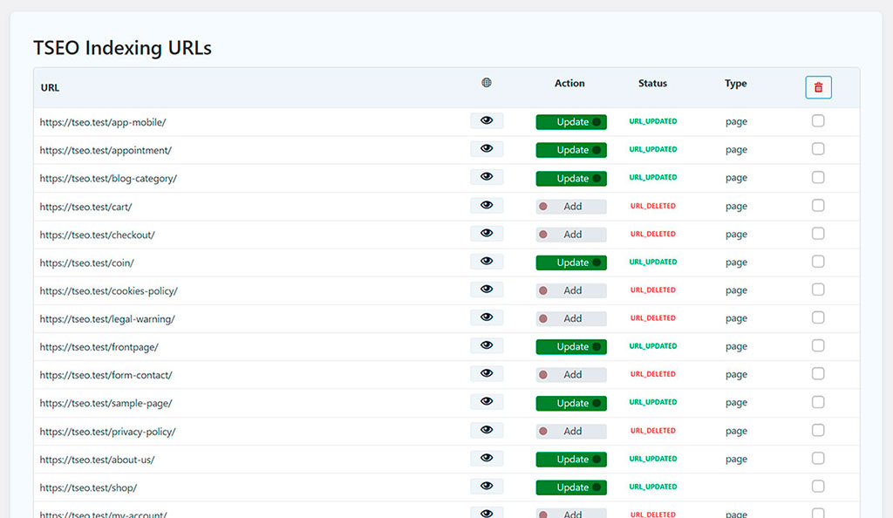
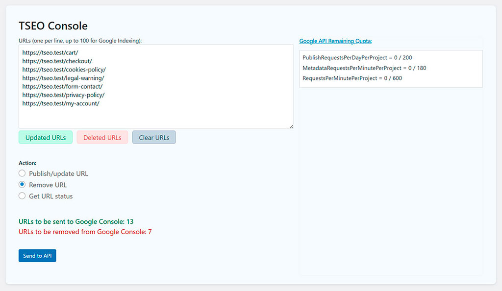

# TSEO Indexing

## Management for indexing URLs in Google Console Search and management of product listings (Woo) for Google Merchant Center with integrated AI.

* Contributors: devtseo
* Tags: wordpress, google, seo, indexing, openai, seo-optimization, google-api, positioning, plugins-wordpress, google-indexing-api, google-console, google-merchant-center
* Requires at least: 6.0
* Tested up to: 6.4.2
* Stable tag: 1.0.0
* Requires PHP: 8.1
* Text Domain: tseoindexing
* Domain Path: /languages/
* License: GPLv2
* License URI: http://www.gnu.org/licenses/gpl-2.0.txt

## Description

This plugin notifies the Google Indexing API about new or updated posts and can request page removals. It integrates with Google Merchant Center to easily set up and submit product listings, featuring AI to generate optimized titles and descriptions. WooCommerce is required for Merchant Center features.

### Key Features:
- Display a visually appealing gallery of your web projects.
- Showcase your web development skills to your audience.
- Enable visitors to assess the quality of each website with ease.
- Seamlessly link to critical performance analysis tools like PageSpeed Mobile, PageSpeed Desktop, Pingdom, GTmetrix, and Google Rich Results.
- Enhance your online portfolio's impact and professionalism.

Whether you're a web developer, designer, or digital agency, TSEO Portfolio simplifies the process of presenting your work in a user-friendly and engaging manner. Elevate your online presence and impress your clients with the quality of your web projects today!

## Installation

1. Upload the tseoindexing folder to the /wp-content/plugins/ directory.
2. Activate the plugin through the 'Plugins' menu in WordPress.
3. Go to the new "TSEO Indexing" menu in your dashboard to add and manage your websites.

## Frequently Asked Questions

### Does this plugin work on multisite?
Yes, the plugin has been tested and verified on WordPress Multisite.

## Screenshots

### Google Console Search

*URL Settings: Lists all the URLs of the site to manage their destination in Google Console Search.*

*Submission Console: Sends the URLs prepared in the list to Console Search according to their condition: Publish/Update or Delete*

### Google Merchant Center

## Upgrade Notice

= 1.0.0 - 31/05/2024 =
* Initial release.

## Changelog

= 1.0.0 - 31/05/2024 =
* Initial release.