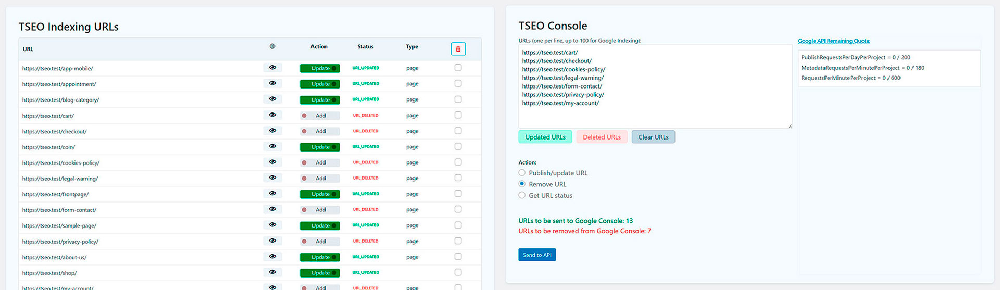

# TSEO Indexing

## Management for Indexing URLs in Google Search Console and Managing Product Listings for Google Merchant Center with Integrated AI.

* Contributors: devtseo
* Tags: wordpress, google, seo, indexing, openai, seo-optimization, google-api, positioning, plugins-wordpress, google-indexing-api, google-console, google-merchant-center
* Requires at least: 6.0
* Tested up to: 6.4.2
* Stable tag: 1.0.0
* Requires PHP: 8.1
* Text Domain: tseoindexing
* Domain Path: /languages/
* License: GPLv2
* License URI: http://www.gnu.org/licenses/gpl-2.0.txt

## Description

This plugin notifies the Google Indexing API about new or updated posts and can request page removals. It integrates with Google Merchant Center to easily set up and submit product listings, featuring AI to generate optimized titles and descriptions. WooCommerce is required for Merchant Center features.

### Key Features:

- **URL Management**: Lists all URLs on the website to manage which to index, update, or delete.
- **Automated and Manual Processing**: Provides a console to automatically process the listed URLs or handle them manually.
- **URL Cleaning Tool**: Includes a tool to clean URLs obtained by copying and pasting from Google Search Console.
- **WooCommerce Integration**: If you use WooCommerce, it lists all products to configure which ones to send to Google Merchant Center.
- **Merchant Center Configuration**: Adds a new tab in the product edit screen to configure the essential attributes required by Merchant Center.

**TSEO Indexing** simplifies the process of URL indexing in Google Search Console and product management in Google Merchant Center. Effectively position your website and, if you have a WooCommerce store, publish your products for free!

## Installation

1. Upload the `tseoindexing` folder to the `/wp-content/plugins/` directory.
2. Activate the plugin through the 'Plugins' menu in WordPress.
3. Navigate to the new "TSEO Indexing" menu in your dashboard to add and manage your websites.

### Initial Configuration:
   - After activation, go to the "TSEO Indexing" menu in your WordPress dashboard to set up your Google Search Console and Google Merchant Center integrations.

## Frequently Asked Questions

### Does this plugin work on multisite?

Yes, the plugin has been tested and verified on WordPress Multisite.

### Is WooCommerce required for all features?

No, WooCommerce is only required for the Google Merchant Center integration features.

### How does the AI generate optimized titles and descriptions?

The AI uses advanced algorithms to analyze your content and create SEO-friendly titles and descriptions.

## Screenshots

### Google Search Console

*URL Settings: Lists all the URLs of the site to manage their status in Google Search Console. Submission Console: Processes the URLs listed for submission to Google Search Console according to their status: Publish/Update or Delete.*

### Google Merchant Center

*Product Listings: Manage and configure your WooCommerce products for submission to Google Merchant Center. Product Editing: Utilize the new tab on the product edit page to set up the required Google Merchant Center attributes for each product.*

## Upgrade Notice

= 1.0.0 - 31/05/2024 =
* Initial release.

## Changelog

= 1.0.0 - 31/05/2024 =
* Initial release.